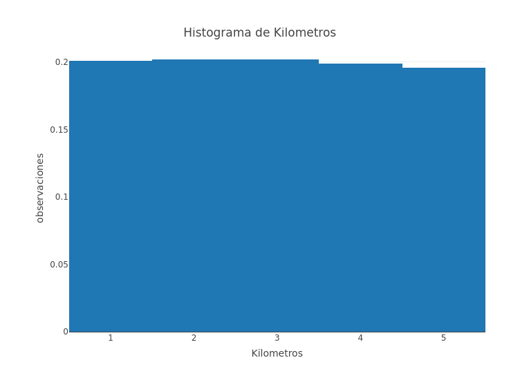

<!-- README.md is generated from README.Rmd. Please edit that file -->
Insurance Analysis
==================

<!-- badges: start -->
<!-- badges: end -->
Se obtuvieron datos de las reclamaciones de una aseguradora en Monterrey. De acuerdo a los datos obtenidos es posible combinar los riesgos del portafolio de la aseguradora. Este reporte se crea como un soporte para el Comité de Riesgo para conocer la estructura de los riesgos así como la influencia de las reclamaciones con las variables que se conocen.

Esta es la base de datos con la que trabajaremos

    #>   Kilometres Zone Bonus Make Insured Claims Payment
    #> 1          1    1     1    1  455.13    108  392491
    #> 2          1    1     1    2   69.17     19   46221
    #> 3          1    1     1    3   72.88     13   15694
    #> 4          1    1     1    4 1292.39    124  422201
    #> 5          1    1     1    5  191.01     40  119373
    #> 6          1    1     1    6  477.66     57  170913

You'll still need to render `README.Rmd` regularly, to keep `README.md` up-to-date. `devtools::build_readme()` is handy for this. You could also use GitHub Actions to re-render `README.Rmd` every time you push. An example workflow can be found here: <https://github.com/r-lib/actions/tree/master/examples>.

You can also embed plots, for example:

In that case, don't forget to commit and push the resulting figure files, so they display on GitHub.
